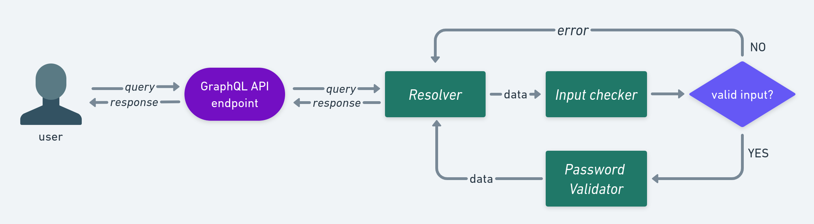

<p align="center">
  <a href="./README_pt-BR.md">Portuguese Version </a>
  <span>:brazil:</span>
</p>

<details>
<summary>Table of contents</summary>

* [The project](#the-project)
    * [API Dataflow](#api-dataflow)
* [Running API](#running-api) 
    * [With Docker](#with-docker)
    * [Without Docker](#without-docker)
* [Consuming API](#consuming-api)
    * [Query](#query)
    * [Arguments](#arguments)
* [Unit and integration tests](#unit-and-integration-tests)
* [Project directory structure](#project-directory-structure)
</details>

# The project
GraphQL API that performs password validation based on a set of password validation rules chosen by the user.

Main technologies used:
* Python 3.10
* [Strayberry](https://strawberry.rocks/)
* Docker
* FastAPI

## API Dataflow


The data flow (shown in the figure above), in a simplified way, is defined as follows: the user makes a `query` providing a password and a set of password validation rules. The rules chosen by the user will be used to validate the provided password.

The `query` is received by the `resolver`, which extracts the data from the query and represents it within the API, and subsequently passes the data on to the `input check`, the module responsible for validating that the data format is correct. For example, in the case of the rules, they can be an empty list `[]` (in this scenario, every password will be valid), however, when defined, they must respect the format `{ rule: <RULE_NAME>, value: <RULE_VALUE> }`. As an example, a rule without the `<value>` field (e.g. `{ rule: <rule> }`) does not respect the expected format, so it is invalid. Another point to consider is the `<value>` field. This field does not accept negative values by definition. For example, imagine that the chosen rule is that the password must have a minimum number of digits. It doesn't make sense for a password to have a minimum of -1 digits, so negative numbers as rule values are not accepted.

If the input format is not respected, a descriptive error of the problem is informed to the user. If the data is in the correct format, the flow continues and the data is passed on to the module that actually validates the password, the `password validator`, which checks if the password meets the rules established by the user. The result of this process is sent to the user as a response.

# Running API
## With Docker
Ensure that the necessary dependencies are installed, these being: Docker and Docker Compose (optional, as it helps in building the image and container, but this action can be done manually).

With Docker Compose installed, go to the root folder of the project and run:
```bash
docker-compose up
```

Wait for the image and container to build. After the process is complete, the API will be available at http://localhost:8000/graphql

Note: If you chose not to use Docker Compose, that's fine. You can still build the container manually with the following commands:
1. Build image
```bash
docker build -t <image-name> .
```

2. Build container
```bash
docker run -p 8000:8000 <image-name>
```
In the end, we will also have the API running at http://localhost:8000/graphql

## Without docker
Make sure you have Python version 3.10.6 or higher. After that, go to the root folder of the project and install the dependencies with the command:
```bash
pip install -r requirements.txt
```

Wait for the dependencies to download and run:
```bash
uvicorn api:app --reload
```

After that, the server will be available at http://localhost:8000/graphql

# Consuming API
## Query
To consume the API, just build a GraphQL query in the format shown below. The query is used to validate a password based on a set of rules.

```graphql
{
  verify(
    password:<PASSWORD>,
    rules: [{rule:<RULE_NAME>, value: <RULE_VALUE>}]
  ) {
    verify
    noMatch
  }
}
```
### Arguments
The query consists of a single field called `verify`, which takes two arguments: `password` and `rules`.

* `password (string)`: represents the password to be verified.
* `rules (list[object])`: contains a list of objects specifying the rules to be applied to the password. Each object has two fields:
    * `rule (string)`: represents the name of the rule.
    * `value (int)`: represents the value of the rule.

### Fields
To use this query, just substitute the placeholders `<PASSWORD>`, `<RULE_NAME>`, and `<RULE_VALUE>` with the desired values. The format of the rules is described below in [Rules](#rules).

The returned result is an object with two fields: `verify` and `noMatch`.

* `verify (boolean)`: result of the password validation. `True` if the password is valid, `False` if it is invalid.
* `noMatch (list[string])`: list of rules that were not satisfied by the password. If the password is valid, this list will be empty.

## Rules
The rules for validating passwords have the following format:

`{rule:<RULE_NAME>, value: <RULE_VALUE>}`

`rule` is a `string` and represents the name of the rule and `value` are positive integers.

The table below lists the available rules for password validation.

| rule name          | accepted values                        | description |
| ------------- | ---------------------------- | ---------------------------- |
`minSize`         | positive integer (ex: 1,2,3,4...) | set a minimum size
`minUppercase`    | positive integer | sets a minimum amount of capital letters
`minLowercase`    | positive integer | sets a minimum amount of lowercase letters
`minDigit`        | positive integer | sets a minimum amount of digits (0-9)
`minSpecialChars` | positive integer | sets a minimum amount of special characters (e.g `!`, `@`, `#`, `$`, `%`, `^`, `&`, `*`, `(`, `)`, `-`,`+`,`/`,`{`,`}`,`[`,`]`)
`noRepeted`       | positive integer (this value will be ignored) | defines that two or more sequential characters must not be repeated (ex: `senha` is valid, but `seenha` is not, because the character `e` was repeated sequentially

# Unit and integration tests
The project is covered by unit and integration tests. To run the tests, simply run the script in the root of the project with the following command
```bash
python3 run_tests.py
```

# Project directory structure
```
.
├─ model                          // graphql models
│ └── password_info.py
│
├─ password
│ └── valid_pass.py               // verifies if the password meets the stipulated rules
│
├─ resolver                       // implementation of the resolvers for the schema
│ └── verify.py
│
├─ schema
│ └── schema.py                   // graphql schema that defines the API
│
├─ tests                          // unit and integration tests
│ ├── test_check_input_password.py
│ ├── test_check_input_rules.py
│ ├── test_integration.py
| └── test_validpass.py
│
├─ utils
│ ├── check_input_password.py      // validates the format of the password input
| └── check_input_rules.py         // validates the format of the rule input
│
├─ api.py                          // API entry point
├─ docker-compose.yml              
├─ Dockerfile                      
├─ README.md
├─ requirements.txt                
└─ run_tests.py                    // script that run all tests
```